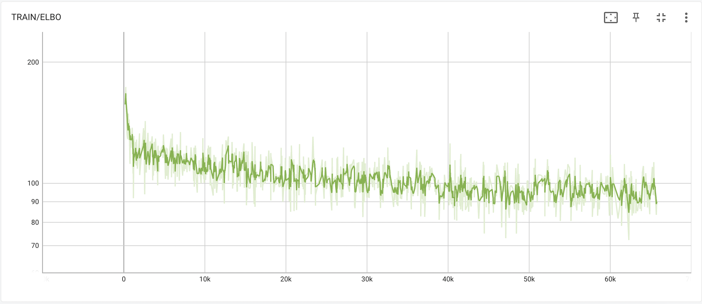
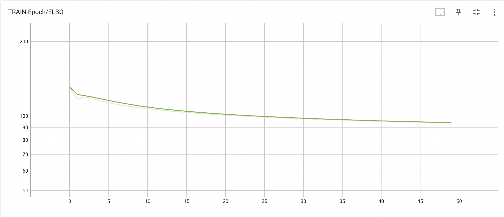
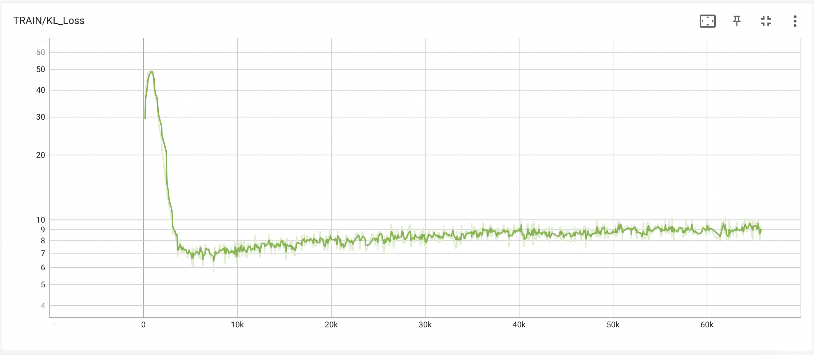
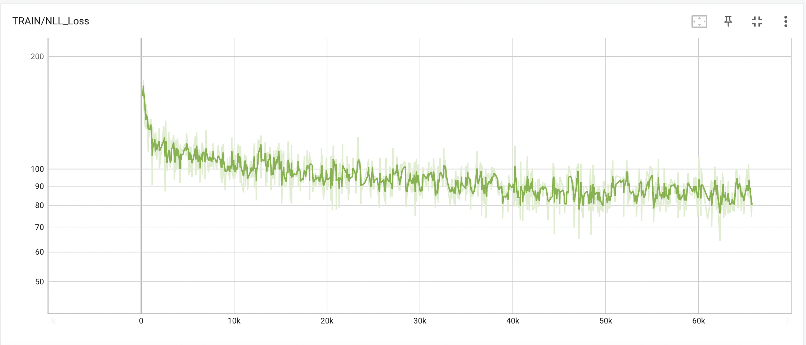
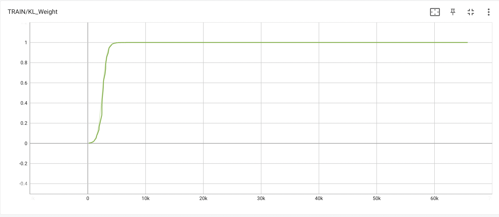

# Sentence VAE Implementation

A re-implementation of the Sentence VAE paper, [Generating Sentences from a Continuous Space](https://arxiv.org/abs/1511.06349). The paper talks about modelling sentences to latent space representations and allowing deterministic decoding of these latent vectors to produce well-formed sentences. This also allows interpolation between two vectors to produce coherent sentences.

*The inspiration for this implementation is from [Tim Baumgärtner's repository](https://github.com/timbmg/Sentence-VAE). The data processing code and some helper functions have been taken from there. The main purpose of this project was to enhance my understanding of VAEs and implement this paper for learning purposes*

## Results

### Performance

#### ELBO


#### Epoch-averaged ELBO


#### KL Divergence loss


#### Negative Log-likelihood Loss


#### KL Weight


### Samples

Sentences have been obtained after sampling from z ~ N(0, I).
```
<sos> there ' s a great difference between the yeast and the cuban drug <eos>
<sos> but the company has n't yet been able to pinpoint a license <eos>
<sos> he said the committee appointed the president ' s motion - year-old civil rights plan to meet with the bush administration ' s request <eos>
<sos> caltrans said the galileo worm had a good luck to the late 1970s <eos>
<sos> some people are facing the variations in the area that they are n't aware of their ignorance says mr . newhouse <eos>
<sos> the u . s . is the only n years of the krasnoyarsk of the krasnoyarsk regime of the krasnoyarsk regime of the krasnoyarsk regime of pravda <eos>
<sos> but we do n't think that the rest of the gun is n't entirely <eos>
<sos> william c . brown president of the prentice hall foundation and construction concern <eos>
<sos> they are inevitably inclined to lure the same circumstances that would be settled <eos>
<sos> and the difficulties are facing difficulties <eos>
```

### Interpolation

Sentences have been obtained after sampling twice from z ~ N(0, I) and then interpolating the two samples.

```
<sos> i ' m not going to be a disaster <eos>
<sos> researchers said the ordinance is slated to be introduced by the virus of the virus that seeks to transform the drug centers <eos>  
<sos> i think the fed is n't committed to the disaster <eos>    
<sos> humana inc . said it signed a $ n million contract for the start-up of the national aeronautics and space force <eos>  
<sos> i think the fed is n't committed to the disaster <eos>  
<sos> osha said the contract signed a $ n million contract with meredith and universities that are used by the drug centers <eos>  
<sos> i think the fed is n't commenting on the region <eos>  
<sos> osha said the contract signed a definitive agreement with the facility and a new york facility in the netherlands and a number of the facility <eos>  
<sos> we do n't want to see the reduction in the next few months <eos>  
<sos> osha said the contract signed a definitive agreement with the facility and a new york facility in the netherlands and a number of seats in the netherlands <eos>  
```

## Training

Use the download_data.sh file to get the Penn Treebank data.

Training is as simple as executing 

```
python train.py
```

To replicate the above results, I used the following config 

```
python train.py --learning_rate 0.001 --num_layers 2 --word_dropout_rate 0.2 --annealing_till 2500
```

Other configs can be seen from the [train.py](train.py) file. 

## Inference

To use the checkpoint provided with this repository, run

```
python inference.py <path_to_checkpoint> -nl 2
```

The configs have to be added based on the training configs of the model checkpoint being used.